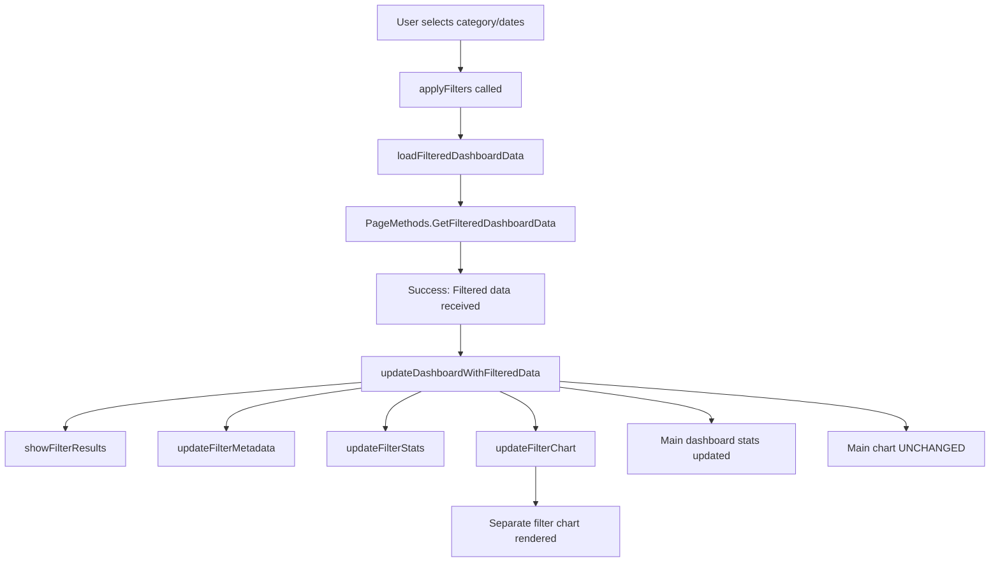

# ?? Separate Filter Chart Feature - Complete Guide

## Overview

We've implemented a **beautiful separate filter results section** that appears **above** the main dashboard when filters are active. This provides a clean separation between filtered data and overall data.

---

## ? Key Features

### 1. **Dual Chart System**
- **Main Chart**: Always shows default period view (Daily/Weekly/Monthly)
- **Filter Chart**: Shows filtered results separately (Category/Date range)

### 2. **Visual Separation**
- Filter results appear in a **gradient purple/blue section**
- **Smooth slide-down animation** when filters are applied
- **Collapsible** with close button
- **Auto-scroll** to filter results

### 3. **Independent Controls**
- Main chart period buttons work independently
- Filter chart shows custom aggregation based on date range
- Users can compare filtered vs overall data

---

## ?? User Experience

### Default State (No Filters):
```
???????????????????????????????????????
?  Dashboard Header                   ?
?  [Category ?] [Start Date] [End]    ?
???????????????????????????????????????
???????????????????????????????????????
?  Main Chart (Monthly by default)    ?
?  [Daily] [Weekly] [Monthly] ? Work  ?
???????????????????????????????????????
?  Stats Cards                        ?
???????????????????????????????????????
```

### With Filters Active:
```
???????????????????????????????????????
?  Dashboard Header                   ?
?  [Skincare ?] [2024-01] [2024-06]  ?
?  × Category: Skincare               ? ? Active filters
???????????????????????????????????????
???????????????????????????????????????
? ?? FILTERED RESULTS - Skincare     ? ? NEW!
? ?????????????????????????????????? ?
?  ?? Filter Chart (Skincare only)   ?
?  Stats: $X sales, Y orders         ?
?                              [×]    ? ? Close
???????????????????????????????????????
???????????????????????????????????????
?  Main Chart (Still Monthly)         ?
?  [Daily] [Weekly] [Monthly] ? Work  ?
???????????????????????????????????????
?  Stats Cards (Overall)              ?
???????????????????????????????????????
```

---

## ?? Visual Design

### Filter Results Section:
- **Background**: Beautiful gradient (Purple ? Blue)
- **Header**: White text with icons
- **Metadata**: Glass-morphism badges showing:
  - ?? Date range
  - ??? Category name
  - ?? Number of data points
- **Chart**: White container with rounded corners
- **Stats**: 4-column grid with hover effects

### Animations:
1. **Slide Down**: 0.4s smooth entrance
2. **Shimmer Effect**: Top border animated gradient
3. **Pulse**: Filter icon gentle pulse
4. **Hover Effects**: Cards lift on hover
5. **Close Animation**: Smooth fade-out

---

## ?? Technical Implementation

### New JavaScript Functions:

#### 1. `showFilterResults()`
```javascript
function showFilterResults() {
    const section = document.getElementById('filterResultsSection');
    section.classList.add('show');
    section.scrollIntoView({ behavior: 'smooth', block: 'start' });
}
```
**Purpose**: Show filter results with smooth animation and scroll

#### 2. `hideFilterResults()`
```javascript
function hideFilterResults() {
    const section = document.getElementById('filterResultsSection');
    section.classList.remove('show');
}
```
**Purpose**: Hide filter results section

#### 3. `closeFilterResults()`
```javascript
function closeFilterResults() {
    resetFilters();
    hideFilterResults();
}
```
**Purpose**: Close button handler - resets filters and hides section

#### 4. `updateFilterMetadata(data, stats)`
```javascript
function updateFilterMetadata(data, stats) {
    // Updates:
    // - Filter title (with category)
    // - Date range display
    // - Category name
    // - Data points count
}
```
**Purpose**: Update all metadata badges in filter header

#### 5. `updateFilterStats(stats)`
```javascript
function updateFilterStats(stats) {
    // Updates 4 stat cards:
    // - Total Sales
    // - Total Orders
    // - Products count
    // - Average Order Value
}
```
**Purpose**: Update filter-specific statistics

#### 6. `updateFilterChart(data)`
```javascript
function updateFilterChart(data) {
    // Creates new Chart.js instance
    // Separate from main chart
    // Shows filtered data
}
```
**Purpose**: Render the filter results chart

#### 7. `updateFilterGrowthIndicator(currentData, lastYearData)`
```javascript
function updateFilterGrowthIndicator(currentData, lastYearData) {
    // Calculate growth percentage
    // Update color (green/red)
    // Update arrow direction
}
```
**Purpose**: Show growth comparison for filtered data

---

## ?? Data Flow

### When User Applies Filters:



### Key Points:
1. ? **Filter data goes to filter chart**
2. ? **Main chart stays on current period**
3. ? **Users can toggle period while filters active**
4. ? **Both charts visible simultaneously**

---

## ?? Benefits

### 1. **Clear Separation of Concerns**
- Filtered data = Filter chart
- Overall data = Main chart
- No confusion about what's being displayed

### 2. **Better Comparison**
- See filtered results AND overall data
- Compare side-by-side
- Understand impact of filters

### 3. **Improved UX**
- Period buttons always work
- No "disabled" controls
- Intuitive close button
- Smooth animations

### 4. **Performance**
- Two independent charts
- No interference
- Clean state management

---

## ?? Styling Classes

### Main Container:
```css
.filter-results-section {
    /* Purple gradient background */
    /* Rounded corners */
    /* Shadow effects */
    /* Slide-down animation */
}
```

### Header:
```css
.filter-results-header {
    /* Flex layout */
    /* White text */
    /* Space between title and close */
}
```

### Metadata Badges:
```css
.filter-meta-item {
    /* Glass-morphism effect */
    /* White transparent background */
    /* Rounded pill shape */
    /* Icon + text */
}
```

### Chart Container:
```css
.filter-chart-container {
    /* White background */
    /* Rounded corners */
    /* Shadow */
    /* Padding */
}
```

### Stats Grid:
```css
.filter-stats-grid {
    /* 4-column responsive grid */
    /* Glass-morphism cards */
    /* Hover lift effect */
}
```

---

## ?? Responsive Design

### Desktop (> 1200px):
```
??????????????????????????????????????????????
?  [Category] [Start] [End] [Reset]          ?
??????????????????????????????????????????????
?  ?? FILTER CHART (Full width)              ?
?  [Stats: 4 columns]                        ?
??????????????????????????????????????????????
?  ?? MAIN CHART (Full width)                ?
??????????????????????????????????????????????
```

### Tablet (768px - 1199px):
```
????????????????????????????????
?  [Cat] [Start] [End] [Reset] ?
????????????????????????????????
?  ?? FILTER CHART             ?
?  [Stats: 2 columns]          ?
????????????????????????????????
?  ?? MAIN CHART               ?
????????????????????????????????
```

### Mobile (< 768px):
```
??????????????????
? [Category ?]   ?
? [Start Date]   ?
? [End Date]     ?
? [Reset]        ?
??????????????????
? ?? FILTER      ?
? [Stats: 1 col] ?
??????????????????
? ?? MAIN        ?
??????????????????
```

---

## ?? Testing Scenarios

### Test 1: Apply Category Filter
1. Select "Skincare" from category dropdown
2. **Expected**:
   - Filter section slides down
   - Shows Skincare-only data
   - Main chart stays on current period
   - Both charts visible

### Test 2: Apply Date Range
1. Set Start: 2024-01-01, End: 2024-06-30
2. **Expected**:
   - Filter section shows 6 months of data
   - Aggregation type adjusts (monthly)
   - Main chart unchanged

### Test 3: Toggle Period While Filtered
1. Apply any filter
2. Click "Daily" on main chart
3. **Expected**:
   - Filter chart unchanged
   - Main chart switches to daily view
   - Both work independently

### Test 4: Close Filter Results
1. Apply filter
2. Click [×] close button
3. **Expected**:
   - Filter section slides up
   - Filters reset
   - Main chart remains visible

### Test 5: Multiple Filters
1. Select Category + Date Range
2. **Expected**:
   - Filter section shows combined filters
   - Metadata shows all active filters
   - Stats reflect filtered data only

---

## ?? Debugging

### Check if Filter Chart is Rendering:

```javascript
// In browser console:
console.log('Filter chart instance:', filterChartInstance);
console.log('Filter section visible:', document.getElementById('filterResultsSection').classList.contains('show'));
```

### Verify Data Flow:

```javascript
// Check filtered data:
console.log('Filtered data:', window.salesData.filtered);

// Check if updateFilterChart was called:
console.log('Filter chart canvas:', document.getElementById('filterChart'));
```

### Common Issues:

#### Issue 1: Filter section doesn't appear
**Fix**: Check `showFilterResults()` is called
```javascript
// Manually trigger:
showFilterResults();
```

#### Issue 2: Chart not rendering
**Fix**: Check canvas element exists
```javascript
console.log('Canvas:', document.getElementById('filterChart'));
```

#### Issue 3: Animations don't work
**Fix**: Check CSS classes
```javascript
// Check if show class is added:
document.getElementById('filterResultsSection').classList.contains('show');
```

---

## ?? Success Criteria

The feature is working correctly when:

1. ? **Filters trigger separate chart**
2. ? **Main chart stays independent**
3. ? **Smooth animations work**
4. ? **Close button resets everything**
5. ? **Metadata updates correctly**
6. ? **Stats show filtered data**
7. ? **No performance issues**
8. ? **Responsive on all devices**

---

## ?? Future Enhancements

### Possible Improvements:

1. **Export Filter Results**
   - PDF export of filtered chart only
   - CSV download of filtered data

2. **Save Filters**
   - Bookmark favorite filter combinations
   - Quick filter presets

3. **Compare Mode**
   - Side-by-side comparison view
   - Multiple filter sets

4. **Advanced Filters**
   - Product-level filtering
   - Supplier filtering
   - Stock status filtering

5. **Chart Customization**
   - Change chart type (Bar, Area, etc.)
   - Toggle data series
   - Adjust time granularity

---

## ?? Related Files

### Modified Files:
- `InventorySystemSiaProject/WebPages/Dashboard.aspx` - HTML + CSS + JS
- `InventorySystemSiaProject/WebPages/Dashboard.aspx.cs` - Backend (unchanged)

### Dependencies:
- Chart.js library (CDN)
- Font Awesome icons (for UI)
- .NET Framework 4.8
- ASP.NET Web Forms
- PageMethods (AJAX)

---

## ?? Quick Reference

### Show Filter Results:
```javascript
showFilterResults();
```

### Hide Filter Results:
```javascript
hideFilterResults();
```

### Update Filter Chart:
```javascript
updateFilterChart(filteredData);
```

### Update Filter Stats:
```javascript
updateFilterStats(dashboardStats);
```

### Close and Reset:
```javascript
closeFilterResults();
```

---

## ?? Key Takeaways

1. **Separation is Key**: Filtered data and overall data are now clearly separated
2. **Independent Controls**: Users can interact with both charts independently
3. **Visual Feedback**: Animations and colors provide clear feedback
4. **Performance**: Two separate chart instances prevent interference
5. **Flexibility**: Users can compare filtered vs overall data easily

---

**Status**: ? **Implemented and Ready for Testing**

**Next Steps**:
1. Restart your application
2. Test category filters
3. Test date range filters
4. Verify both charts work independently
5. Test close button functionality

---

**Enjoy your beautiful new separate filter chart!** ??
